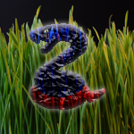

<!-- PROJECT LOGO -->
 

  

<h3 align="center">Snake</h3>

  

    Gra Snake wykonana na zaliczenie z GUI przy użyciu biblioteki Swing.
  

<!-- TABLE OF CONTENTS -->

  
Spis treści

  <ol>
    <li>
      <a href="#o-projekcie">O projekcie</a>
      <ul>
        <li><a href="#zbudowane-przy-pomocy">Zbudowane przy pomocy</a></li>
      </ul>
    </li>
    <li><a href="#licencja">Licencja</a></li>
    <li><a href="#kontakt">Kontakt</a></li>
  </ol>

<!-- ABOUT THE PROJECT -->
## O projekcie

- Wynik gracza jest obliczany na podstawie zjedzonych elementów (1 jabłko = 10 pkt). Wraz ze zjedzeniem elementu gra przyśpiesza.
- Gra zaczytuje i prezentuje najlepszy wynik (opcja wyświel wyniki). Gra posiada również możliwość zapisania do 100 ostatnich wyników (w postaci JTextArea w JScrollPane).
- Gracz przegrywa jeżeli wąż zderzy się sam ze sobą bądź z oknem.
- Gracz posiada możliwość wyboru koloru siatki, koloru głowy węża, koloru ciała węża oraz koloru jabłka.

(<a href="#top">powrót do początku</a>)

### Zbudowane przy pomocy

* [Swing](https://docs.oracle.com/javase/7/docs/api/javax/swing/package-summary.html)

(<a href="#top">powrót do początku</a>)

<!-- LICENSE -->
## Licencja

Dystrybucja na podstawie licencji MIT. Sprawdź `LICENSE` po więcej informacji.

(<a href="#top">powrót do początku</a>)

<!-- CONTACT -->
## Kontakt

Tomasz Serafiński - work.serafinski@gmail.com

Link do projektu: [https://github.com/serafinski/Snake_Swing](https://github.com/serafinski/Snake_Swing)

(<a href="#top">powrót do początku</a>)

