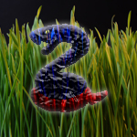

 

  

<h3 align="center">Snake</h3>

  

    Gra Snake wykonana na zaliczenie z GUI przy użyciu biblioteki Swing.
  

## O projekcie

- Wynik gracza jest obliczany na podstawie zjedzonych elementów (1 jabłko = 10 pkt). Wraz ze zjedzeniem elementu gra przyśpiesza.
- Gra zaczytuje i prezentuje najlepszy wynik (opcja wyświel wyniki). Gra posiada również możliwość zapisania do 100 ostatnich wyników (w postaci JTextArea w JScrollPane).
- Gracz przegrywa jeżeli wąż zderzy się sam ze sobą bądź z oknem.
- Gracz posiada możliwość wyboru koloru siatki, koloru głowy węża, koloru ciała węża oraz koloru jabłka.

### Zbudowane przy pomocy

* [Swing](https://docs.oracle.com/javase/7/docs/api/javax/swing/package-summary.html)
